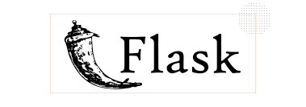

<html>
  <body>
    <h1 align="center">Hi 👋, I'm Deepak</h1>
    <h3 align="left">Languages and Tools Used:</h3>
    <table>
      <tr>
        <td></td>
        <td>Python</td>
        <td>
          <label for="file">Downloading progress:</label>
          <progress value="90" max="100">90%</progress>
        </td>
      </tr>
      <tr>
        <td></td>
        <td>FastAPI</td>
        <td><progress value="90" max="100">90%</progress></td>
      </tr>
      <tr>
        <td></td>
        <td>OpenAI</td>
        <td><progress value="70" max="100">70%</progress></td>
      </tr>
      <tr>
        <td></td>
        <td>Microsoft Bot Framework</td>
        <td><progress value="75" max="100">75%</progress></td>
      </tr>
      <tr>
        <td></td>
        <td>Golang</td>
        <td><progress value="70" max="100">70%</progress></td>
      </tr>
      <tr>
        <td></td>
        <td>CSS3</td>
        <td><progress value="50" max="100">50%</progress></td>
      </tr>
      <tr>
        <td></td>
        <td>HTML5</td>
        <td><progress value="70" max="100">70%</progress></td>
      </tr>
      <tr>
        <td></td>
        <td>JavaScript</td>
        <td><progress value="70" max="100">70%</progress></td>
      </tr>
      <tr>
        <td></td>
        <td>MySQL</td>
        <td><progress value="70" max="100">70%</progress></td>
      </tr>
      <tr>
        <td></td>
        <td>Node.js</td>
        <td><progress value="50" max="100">50%</progress></td>
      </tr>
      <tr>
        <td></td>
        <td>Django</td>
        <td><progress value="90" max="100">90%</progress></td>
      </tr>
      <tr>
        <td></td>
        <td>Flask</td>
        <td><progress value="90" max="100">90%</progress></td>
      </tr>
      <tr>
        <td></td>
        <td>AWS</td>
        <td><progress value="85" max="100">85%</progress></td>
      </tr>
    </table>
  </body>
</html>
